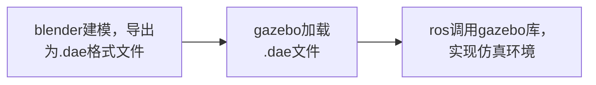
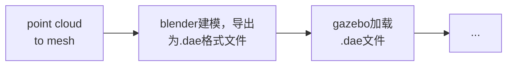

GNSS_NNU组会汇报

---
layout: 2-images-x
image1: 使用gazebo内置组件创建仿真环境.png
image2: 使用gazebo内置组件建模.png
imageComment1: 使用gazebo内置组件创建仿真环境
imageComment2: 使用gazebo内置组件建模
imageRatio1: h-1/2
imageRatio2: h-1/2
imageOrder: 2

---


# 如何将真实环境转换为ros仿真环境
gazebo是ros中常用的仿真模块，使用gazebo搭建仿真环境的方法有：
1. 直接添加内置组件创建仿真环境
2. 利用gazebo自带的建模工具手动绘制仿真环境
3. 通过添加.dae文件，搭建仿真环境。


---

## 仿真模型描述文件
### .world文件
gazebo的仿真环境配置会保存为world后缀的文件。world文件其实是sdf语言书写的文件。里面包含了对三维环境的描述。下面代码为一个campus.world描述文件：
<div class = "overflow-auto h-35 ">
```xml
<sdf version='1.6'>
	<world name='default'>
	...
	<model name='map'>
	<static>1</static>
	<link name='link'>
	<visual name='visual'>
		<geometry>
			<mesh>
				<uri>model://campus/meshes/campus.dae</uri>
			</mesh>
		</geometry>
	</visual>
	<self_collide>0</self_collide>
	<kinematic>0</kinematic>
	</link>
	<pose frame=''>0 0 1 0 0 0</pose>
	</model>
	</world>
</sdf>
```
</div>

### Collada DAE概述
.dae(Digital Asset Exchange)是一种数字资产交换文件格式，用于在各种图形程序之间交换数据。它可以包含图像、纹理或者3D模型。这种文件格式基于XML COLLADA格式，该格式是协作设计活动的缩写。COLLADA是一种开放标准，由Khronos Group管理，旨在促进3D内容的交换和共享。


---
layout: 2-images-x
image1: cmu campus overview.png
image2: campus.dae示意图.png
imageComment1: cmu campus overview
imageComment2: campus.dae示意图
imageRatio1: h-1/2
imageRatio2: h-1/2
imageOrder: 2

---
## ros仿真环境实现流程
以cmu-exploration团队开源仓库中提供的校园仿真环境为例，其环境构建的流程可以表示为：

在blender中打开这个.dae文件发现：cmu的校园模型实际上是一个texturemesh模型加上很多个栅栏模型组成的。
> 结合项目文件夹中还有一个.ply文件

推测在blender建模步骤前还有一个步骤，即从点云文件构建网格文件。



---
layout: 3-images
image1: blender 几何节点设置.png
image2: 点云文件转换前.png
image3: 点云文件转换后.png

---

# 点云（point cloud）到网格（mesh）
通过blender的几何节点（geometry nodes）功能，主要是使用点到体积、体积到网格两个节点完成需求。
- *点到体积*节点在输入几何体的每个点周围生成一个雾状体积球。
- *体积到网格*节点在一个体积的 "表面 "上生成一个网格。


---

还有一些其他的方法，比如：
1. **Poisson Reconstruction**: Poisson Reconstruction是一种基于泊松方程的点云重建方法，可以将点云转换为平滑的mesh。该方法使用点云的法向量来计算泊松方程，并生成一个平滑的mesh。
    
2. **Marching Cubes**: Marching Cubes是一种基于体素的点云重建方法，可以将点云转换为mesh。该方法将点云数据转换为体素网格，并使用Marching Cubes算法从体素网格中提取表面。
    
3. **Ball Pivoting Algorithm**: Ball Pivoting Algorithm是一种基于三角剖分的点云重建方法，可以将点云转换为mesh。该方法使用球体来构建三角剖分，并从球体上移动球来构建mesh。
    
4. **Moving Least Squares**: Moving Least Squares是一种基于曲面拟合的点云重建方法，可以将点云转换为平滑的mesh。该方法使用最小二乘法来拟合点云数据，并生成一个平滑的mesh。

这些方法背后使用的算法不同，构建出的模型的样式和精度都可能不同，但是相同的点在于都能够得到一个网格模型，并且这么多种方法说明从点云到网格的构建方法是比较成熟的。

---
layout: 3-images-x-copy3
image1: 摄影测量三维重建.png

---
# 摄影测量三维重建
一些摄影测量软件比如context capture也可以输出obj、dae、stl等格式，结合cmu campus 模型屋顶信息齐全的特征，不排除该模型是通过摄影测量三维重建生成的。
 

验证可行性构建步骤：
1. 从sketchfab下载了一个摄影测量三维重建模型，格式为obj
2. 将其导入blender中，导出为.dae文件
3. 在项目文件夹中新建.world文件
4. 修改项目中的.launch文件  
5. 启动仿真  

---
layout: default

---

# 总结
对于怎么在ros中建立一个自己的仿真环境可以分以下情况
- 室内环境（规整并且比较简单）
	- 通过建模软件构建
- 室外环境（起伏的地形和错综复杂的环境布局）
	- 从点云生成
	- 从三维重建生成
    - ...

---
layout: 2-images-x
image1: 确立事项.png
image2: 通过页面创建知识库.png
imageComment1: 在工作空间中确立事项
imageComment2: 通过页面创建知识库
imageRatio1: h-1/2
imageRatio2: h-1/2

---
# 项目管理
通过项目管理软件来管理项目，跟踪任务、bug、需求，提高工作效率。
### 确立事项
- 在一个开发项目下根据需求建立一系列事件。
- 一个大的事件下方允许有子事件。
- 事件的类别可以自定义（任务、bug、需求等）
### 建立知识库
通过建立知识库可以在项目开发的过程同时完善技术文档的编写，并便于实时反馈项目中的问题。

---
layout: 3-images-x
image1: 01-需求分析-项目需求.png
imageComment1: 01-需求分析-项目需求
image2: 导航软件系统功能设计图.png
imageComment2: 02-技术实现-导航软件系统功能设计图
image3: 前置知识库-已有案例分析.png
imageComment3: 03-前置知识库-已有案例分析
imageRatio1: h-2/5
imageRatio2: h-2/5
imageRatio3: h-1/5


---
### 知识库构成
- 01-需求分析  
明确项目的需求，及时且有序推进项目
- 02-技术实现  
项目中的各种设计模式，实现的api文档
- 03-前置知识库  
对现有案例的分析，使用到的模块对应文档
- 04-问题解决  
解决开发过程中遇到的难题及bug

---
layout: xxx

---
# 01一级标题
## 02二级标题
### 03三级标题
#### 04四级标题
##### 05五级标题
###### 06六级标题
正文正文
- 01-需求分析  
明确项目的需求，及时且有序推进项目
- 02-技术实现  
项目中的各种设计模式，实现的api文档
- 03-前置知识库  
对现有案例的分析，使用到的模块对应文档
- 04-问题解决  
解决开发过程中遇到的难题及bug

---
layout: cover-own-define
image: cover-down.png

---
