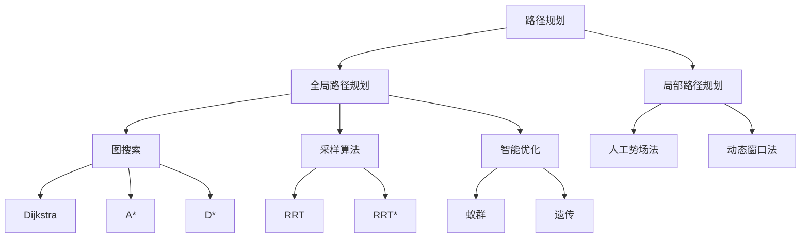
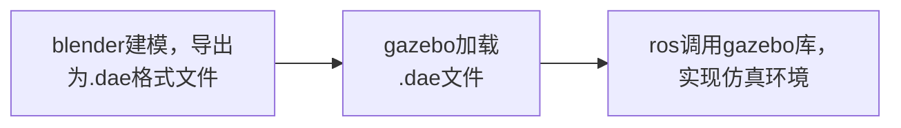
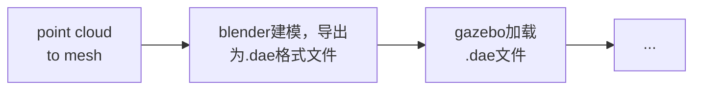

GNSS_NNU汇报

---
layout: toc

---
<Toc class= "minDepth:0"/>

---
layout: default

---
# 路径规划算法
**全局路径规划 (Global Path Planning)**：
1. **环境知识**：全局路径规划通常基于完全或部分已知的环境模型进行，需要有一个清晰的环境地图。
2. **优化目标**：可能关注路径的最优性，如最短路径、最低能耗等。
3. **计算复杂度**：由于需要处理大量的环境信息和可能的路径，全局路径规划的计算复杂度可能较高。
4. **预先规划**：通常在机器人执行任务前进行，得到一个从起点到终点的路径。
  
**局部路径规划 (Local Path Planning)**：
1. **环境知识**：局部路径规划通常在部分未知或动态环境中进行，重点是处理机器人附近的环境信息。
2. **实时性**：需要在实时或近实时条件下为机器人提供可行路径，以应对动态障碍物和环境变化。
3. **反应速度**：局部路径规划通常需要快速响应，以保证机器人在复杂环境中的安全和有效性。
4. **即时规划**：通常在机器人执行任务过程中进行，以应对实时的环境变化。

这两个层次的路径规划通常是相辅相成的
<!--
目前路径规划问题通常可以分为全局路径规划（Global Path Planning）和局部路径规划（Local Path Planning）两个层次。这两者之间的主要区别在于所处理的信息量和应用的时空范围。
全局路径规划主要关注在已知环境中从起始点到目标点的路径规划问题，其目标是寻找一个最优或者可行的路径，使车辆或机器人能够到达目标位置。
局部路径规划主要关注在局部未知或动态变化的环境中进行实时路径规划，以应对环境中的障碍物和动态变化。
全局路径规划为车辆提供了一个大致的路径指南，而局部路径规划则帮助车辆在全局路径的指导下，实时应对环境中的动态变化和未知障碍，确保车辆能够安全、有效地完成任务。
-->

---
layout: 

---


目前路径规划算法的应用趋势是将其组合使用，或是使用改进的上述经典算法。

<!--
全局路径规划按照技术层面可以分为三个方面，一个是图搜索算法和采样算法，还有个智能优化这三种。

局部路径规划的话，目前比较经典的两种算法，一个是人工势场法和一个动态窗口法。
-->


---
layout: 2-images-x
image1: AMCL.png
imageComment1: AMCL节点
image2: 代价地图.png
imageComment2: 代价地图的组成
imageRatio1: h-1/4
imageRatio2: h-3/4

---
# 路径规划算法开源仓库介绍
该[仓库](https://github.com/ai-winter/ros_motion_planning)对常见路径规划算法基于著名ros库navigation库进行了实现，其通过调用**move_base**节点实现导航功能；调用**AMCL**节点实现定位功能；调用**costmap_2d**节点完成了地图的建立。

**costmap_2d**：在静态地图的基础之上添加一些辅助信息的地图，代价地图有两张:global_costmap和local_costmap，分别用于全局和局部路径规划。两张代价地图都可以多层叠加，一般有以下层级:
- Static Map Layer：静态地图层。
- Obstacle Map Layer：障碍地图层，导航过程中传感器感知的障碍物信息。
- Inflation Layer：膨胀层，在以上两层地图上进行膨胀（设置向外扩张的安全区域），以避免机器人的外壳撞上障碍物。
- Other Layers：根据业务自定义的costmap。 
<!--
move_base：根据给定的目标点，控制机器人底盘运动至目标位置，并且在运动过程中会连续反馈机器人自身的姿态与目标点的状态信息。
AMCL：Adaptive Monte Carlo Localization（也就是自适应蒙特卡洛定位）的简称，根据已经有的地图进行定位。在AMCL包中配置了运动模型、传感器模型、蒙特卡洛航位推算算法、采样算法等等功能模块。传感器模型将传感器数据结构化，运动模型将机器人的运动进行分解和代数化。传感器模型和运动模型相辅相成，紧密合作，为蒙特卡洛滤波做好数据支撑。采样/重采样算法为定位的迭代运算和误差消除提供保障。
costmap_2d 包提供了一个可配置的结构，该结构以占用网格的形式维护有关机器人应导航到何处的信息。 costmap 使用传感器数据和来自静态地图的信息，通过 costmap_2d::Costmap2DROS 对象来存储和更新有关世界中障碍物的信息。 costmap_2d::Costmap2DROS 对象为其用户提供纯二维接口，这意味着有关障碍物的查询只能在列中进行。例如，桌子和鞋子在 XY 平面中处于相同位置，但 Z 位置不同，将导致 costmap_2d::Costmap2DROS 对象的代价地图中的相应单元格具有相同的成本值。这旨在帮助平面空间中的规划。 
-->

---
layout: video
video: 2024-01-25 16-12-50.mp4

---
下方为全局路径规划采用A\*算法，局部路径规划采用dwa算法时的运行演示：


---
layout: 2-images-x
image1: 使用gazebo内置组件创建仿真环境.png
image2: 使用gazebo内置组件建模.png
imageComment1: 使用gazebo内置组件创建仿真环境
imageComment2: 使用gazebo内置组件建模
imageRatio1: h-1/2
imageRatio2: h-1/2
imageOrder: 2

---


# 构建仿真环境
**gazebo**：Gazebo是一款3D动态模拟器，能够在复杂的室内和室外环境中准确有效地模拟机器人群。Gazebo提供高保真度的物理模拟，并提供一整套传感器模型，以及对用户和程序非常友好的交互方式。  
gazebo是ros中常用的仿真模块，使用gazebo搭建仿真环境的方法有：
1. 直接添加内置组件创建仿真环境
2. 利用gazebo自带的建模工具手动绘制仿真环境
3. 通过添加.dae文件，搭建仿真环境。


---

## 仿真模型描述文件
### .world文件
gazebo的仿真环境配置会保存为world后缀的文件。world文件其实是sdf语言书写的文件。里面包含了对三维环境的描述。下面代码为一个campus.world描述文件：
<div class = "overflow-auto h-45 ">
```xml
<sdf version='1.6'>
	<world name='default'>
	...
	<model name='map'>
	<static>1</static>
	<link name='link'>
	<visual name='visual'>
		<geometry>
			<mesh>
				<uri>model://campus/meshes/campus.dae</uri>
			</mesh>
		</geometry>
	</visual>
	<self_collide>0</self_collide>
	<kinematic>0</kinematic>
	</link>
	<pose frame=''>0 0 1 0 0 0</pose>
	</model>
	</world>
</sdf>
```
</div>

### Collada DAE概述
.dae(Digital Asset Exchange)是一种数字资产交换文件格式，用于在各种图形程序之间交换数据。它可以包含图像、纹理或者3D模型。这种文件格式基于XML COLLADA格式，该格式是协作设计活动的缩写。COLLADA是一种开放标准，由Khronos Group管理，旨在促进3D内容的交换和共享。


---
layout: 2-images-x
image1: cmu campus overview.png
image2: campus.dae示意图.png
imageComment1: cmu campus overview
imageComment2: campus.dae示意图
imageRatio1: h-1/2
imageRatio2: h-1/2
imageOrder: 2

---
## ros仿真环境实现流程
以cmu-exploration团队开源仓库中提供的校园仿真环境为例，其环境构建的流程可以表示为：

在blender中打开这个.dae文件发现：cmu的校园模型实际上是一个texturemesh模型加上很多个栅栏模型组成的。
> 结合项目文件夹中还有一个.ply文件

推测在blender建模步骤前还有一个步骤，即从点云文件构建网格文件。



---
layout: 3-images
image1: blender 几何节点设置.png
image2: 点云文件转换前.png
image3: 点云文件转换后.png

---

## 点云（point cloud）到网格（mesh）
通过blender的几何节点（geometry nodes）功能，主要是使用点到体积、体积到网格两个节点完成需求。
- *点到体积*节点在输入几何体的每个点周围生成一个雾状体积球。
- *体积到网格*节点在一个体积的 "表面 "上生成一个网格。


---

还有一些其他的方法，比如：
1. **Poisson Reconstruction**: Poisson Reconstruction是一种基于泊松方程的点云重建方法，可以将点云转换为平滑的mesh。该方法使用点云的法向量来计算泊松方程，并生成一个平滑的mesh。
    
2. **Marching Cubes**: Marching Cubes是一种基于体素的点云重建方法，可以将点云转换为mesh。该方法将点云数据转换为体素网格，并使用Marching Cubes算法从体素网格中提取表面。
    
3. **Ball Pivoting Algorithm**: Ball Pivoting Algorithm是一种基于三角剖分的点云重建方法，可以将点云转换为mesh。该方法使用球体来构建三角剖分，并从球体上移动球来构建mesh。
    
4. **Moving Least Squares**: Moving Least Squares是一种基于曲面拟合的点云重建方法，可以将点云转换为平滑的mesh。该方法使用最小二乘法来拟合点云数据，并生成一个平滑的mesh。

这些方法背后使用的算法不同，构建出的模型的样式和精度都可能不同，但是相同的点在于都能够得到一个网格模型，并且这么多种方法说明从点云到网格的构建方法是比较成熟的。

---
layout: 3-images-x-copy3
image1: 摄影测量三维重建.png

---
## 摄影测量三维重建
一些摄影测量软件比如context capture也可以输出obj、dae、stl等格式，从摄影测量三维重建生成的模型构建仿真环境的步骤可以简化为：
 


1. 从sketchfab下载了一个摄影测量三维重建模型，格式为obj
2. 将其导入blender中，导出为.dae文件
3. 在项目文件夹中新建.world文件
4. 修改项目中的.launch文件  
5. 启动仿真  

---
layout: default

---

## 总结
对于怎么在ros中建立一个自己的仿真环境可以分以下情况
- 室内环境（规整并且比较简单）
	- 通过建模软件构建
- 室外环境（起伏的地形和错综复杂的环境布局）
	- 从点云生成
	- 从三维重建生成
    - ...
---
layout: cover-own-define
image: cover-down.png

---
